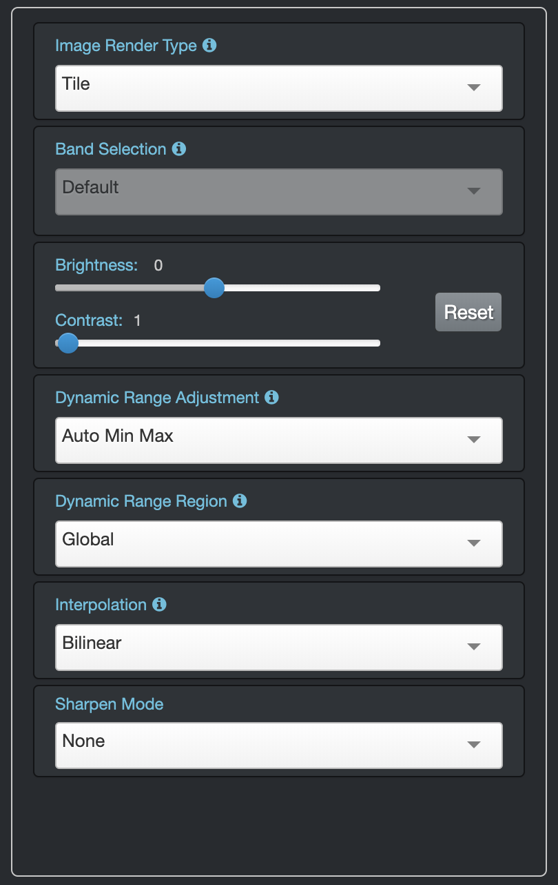
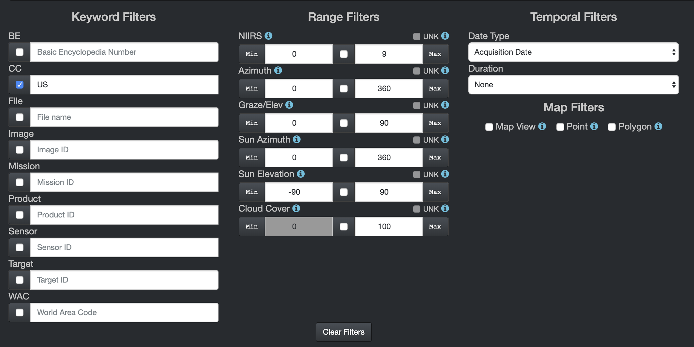
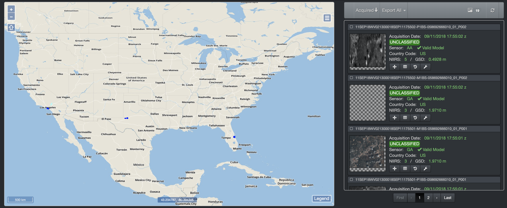
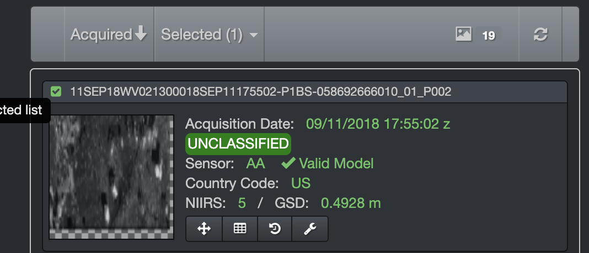
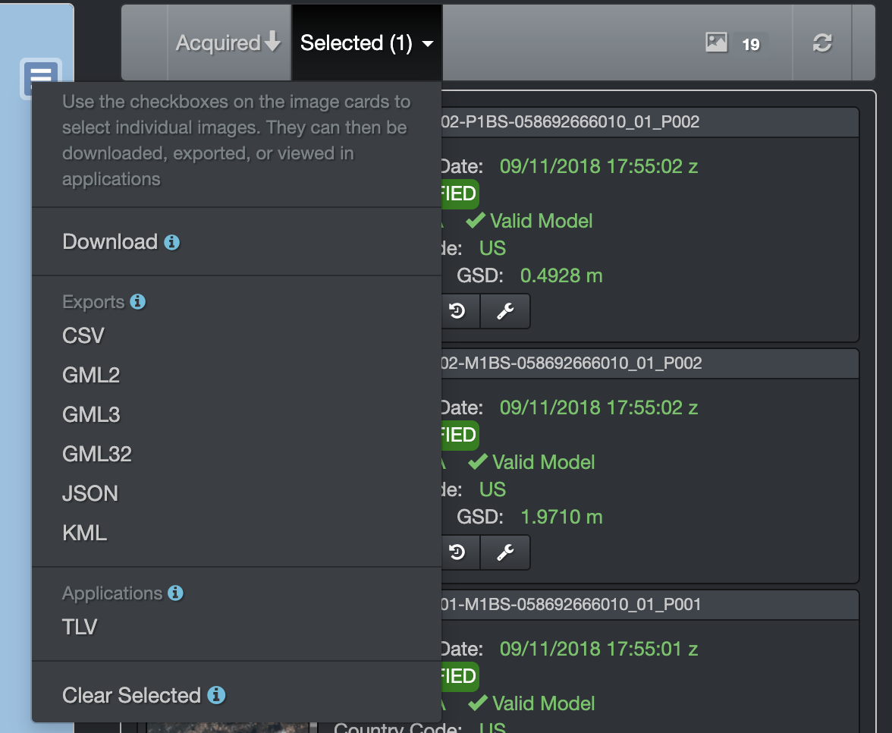

# OMAR-UI

## Home Navigation Bar

### About
- **Contact** for more information on the O2 project
- **Release** current O2 release name
- **Release Number** current O2 release number

### Metrics
- **Service Health & Status** Displays a Spring Cloud Eureka page with information on the system status, uptime, and individual service statuses for the O2 deployment
- **Services Monitor** Displays any errors occurring on currently running services.

## Image Search

### Filters

#### Keyword
* **BE:**
Basic Encyclopedia Number - An alphanumeric sequence representing a particular target.
* **CC:**
Country Code - Two letters representing a particular country.
* **File:**
Filename - The filename of an image.
* **Image:**
Image ID - The Image ID found in the metadata.
* **Mission:**
Mission ID - The image's mission ID.
* **Product:**
Product Type - The Product type found in the metadata.
* **Sensor:**
Sensor ID - The image's sensor ID.
* **Target:**
Target ID - The image's target ID.
* **WAC:**
World Area Code - A numeric sequence representing a particular are on the globe.

#### Ranges
* **NIIRS:**
A number between 0 and 9.
* **Azimuth:**
A number between 0 and 360.
* **Graze/Elev:**
A number between 0 and 90.
* **Sun Azimuth:**
A number between 0 and 360.
* **Sun Elevation:**
A number between -90 and 90.
* **Cloud Cover:**
A number between 0 and 100.

#### Temporal
* **Date Type:**
Specify which metadata field is to be compared, acquisition date or ingest date.
* **Duration:**
Specify the start and stop dates.

#### Map
* **Map Viewport:**
This filter is on by default. It constrains the query to the boundaries of the current map extent.
* **Point:**
Single clicking on the map will return a potential list of images at that location.
* **Polygon:**
Left-click and hold with the ALT key to create a box that will return a potential list of images.

### Footprints
The map will show footprints for all the imagery in the database according to whatever filters are enabled. Every time the map is moved, a new query is issued and the footprints as well as search results are updated.

TIP: You can right-click the map to get that point's coordinate. Also, the mouse-coordinate format found at the bottom-right of the map can be changed simply by clicking on it.

### Results
Search results are displayed in a box to the right of the map with the total number of results shown in the top-right corner.

#### Associated Links
* **&nbsp;:**
Zoom to an image extent.
* **&nbsp;:**
Open the metadata card for the image.
* **&nbsp;:**
View an orthorectified version of an image in TLV.
* **&nbsp;:**
Open the toolbox of the image for even more options.

#### Sort
* **Acquired (Newest):**
Sorts the list such that the image with the most recent acquisition date is first.
* **Acquired (Oldest):**
Sorts the list such that the image with the most recent acquisition date is last.
* **Ingested (Newest):**
Sorts the list such that the image with the most recent ingest date is last.
* **Ingested (Oldest):**
Sorts the list such that the image with the most recent acquisition date is last.
* **Image ID (Asc):**
Sorts the list in alphabetical order according to image ID.
* **Image ID (Desc):**
Sorts the list in reverse alphabetical order according to image ID.
* **Mission (Asc):**
Sorts the list in alphabetical order according to mission ID.
* **Mission (Desc):**
Sorts the list in reverse alphabetical order according to mission ID.
* **Sensor (Asc):**
Sorts the list in alphabetical order according to sensor ID.
* **Sensor (Desc):**
Sorts the list in reverse alphabetical order sensor to image ID.

### Viewing Results
To view an image in the viewport simply check the box in the upper-left corner of its entry in the carousel.

## Map Controls

### Rotation
You can rotate the map by holding Shift + Alt while clicking and dragging.

### Mouse Coordinates
The current coordinate of the mouse is displayed in the lower-right corner of the map. You can click the box to cycle through DD, DMS and MGRS formats. Right-click anywhere on the map to get a dialog box of that coordinate in all three formats.

### Map Legend
On the bottom-right corner of the ViewPort, there is a legends button. Clicking this will bring up a color-code for the footprints seen on the map, which differentiates between image types by color.

### Map Configuration
* **Video Footprints:**
Check this box to have video data footprints rendered on the map.
* **Image Footprints:**
Check this box to have image data footprints rendered on the map.
* **Mosaics:**
Check the Auto box to have images automatically mosaiced and rendered on the map after a certain zoom level without having to select them from the carousel.
* **Base Maps:**
Select the base map that best matches the experience you are looking for.

## Image Space
Access an image in Image Space simply by clicking on the its thumbnail in the carousel.

### Geo-Jump
There is an input box located above the map all the way to the left. The box is meant to take in various kinds of input and will automatically determine if a BE, coordinate or placename is entered. In all cases, if a match is found, the map will center to the appropriate area.

### Download
Download a raw image file. _Note: This will package the raw, overview, and histogram files into a zip folder._

### Measure
* **Path:**
Single-click to start measuring. Double-click to end.
* **Area:**
Single-click to start measuring. Double-click to end.
* **Clear:**
Disables the measurement map interaction.
* **PQE:**
Position Quality Evaluator attempts to map a pixel with a geographic coordinate (i.e. lat/lon) by conducting a ray-trace intersection through the surface of the Earth using the image's sensor model (when available).
* **Enable:**
Just click anywhere.
* **Clear:**
Disable to PQE map interaction.

### Share
Get a sharable link of the image.

### Screenshot
This will pretty much make the map take a selfie and then your browser will download the result.

### Zoom
* **Full Resolution:**
Zooms the map to full resolution.
* **Maximum Extent:**
Zooms the map out until the entire image can fit in the viewport.

### Image Properties

#### Image Render Type
Select whether you would like the image to load as multiple tiles or a single tile.
#### Band Selection
For multi-banded imagery, the red, green and blue "color guns" can be routed to any band within the image. Please aim responsibly.
#### Brightness
Uniformly adjust the brightness value of each pixel.
#### Contrast
Uniformly adjust the contrast value of each pixel, making the light pixels lighter and the dark pixels darker.
#### Dynamic Range Adjustmet
Adjust the ratio of the brightest to darkest pixel. Have you had your coffee yet, because this is about to get statistical. If you take the brightness value of each pixel and make a histogram (that bell-curve thing from school that you always seemed to be on the wrong side of) you'll end up with some kind of overall shape. The DRA setting literally "stretches" or "squishes" that shape. Then all those brighrness values are redistributed which can greatly enhance the overall image.
#### Dynamic Range Region
Select whether you would like the DRA to be applied gloablly or only the area covered by the viewport.
#### Interpolation
Select the method by which unknown pixels are determined from known pixels. Things get complicated during image processing, for example, when enlarging an image. If you end up with more pixels than you started, how do you determine what those new pixels look like? Do you poll the audience, phone a friend or maybe just look at the neighboring pixels?
#### Sharpen Mode
Select the kernel size used for sharpening. You can also try squinting really hard to bring things into focus.

## Image Operations
These are a list of operations that can be done on the image results in your carousel.

### Export All
Click this option after selecting one or more images in your carousel to do any of the following operations for all selected images.

* **Download:**
Download a raw image file.
* **CSV:**
Comma Separated Values - Produces a listing of the images and metadata in CSV format.
* **GML2:**
Geography Markup Language - Produces a listing of the images and metadata in GML2 format.
* **GML3:**
Geography Markup Language - Produces a listing of the images and metadata in GML3 format.
* **GML32:**
Geography Markup Language - Produces a listing of the images and metadata in GML32 format.
* **JSON:**
Javascript Object Notation - Produces a listing of the images and metadata in JSON format.
* **KML:**
Keyhole Markup Language - Produces a listing of the images and metadata in KML format.
* **TLV:**
Time Lapse Viewer - Opens a new window to view
* **Clear Selected:**
Clear all currently selected images.

### Toolbox
By clicking on the wrench icon mentioned above, you can access all kinds of powerful operations on an image.

* **KML Export:**
Download a KML document for the image.
* **Download:**
Download a raw image file
* **Share:**
Get a shareable link for the image.
* **WMS Get Capabilities:**
Get a shareable link for the GetCapabilities for the image.
* **WMS Get Map:**
Get a shareable link for the GetMap for the image.
* **Run Detections:**
Run a machine learning workflow on the image.

### Geo-Jump
There is an input box located above the map all the way to the right. The box is meant to take in various kinds of input and will automatically determine if a BE, coordinate, image ID or placename is entered. In all cases, if a match is found, the map will zoom to the appropriate area.

### Image Upload
Ever had an image locally and wish you could take advantage of all the things O2 has to offer to exploit it? Click on the O2 drop-down button on the left side of the nav bar and select "Image Upload" to directly upload your local image into O2 and view it within minutes.

## Use Cases

### Making a Simple Image Search
The first page you are brought to when navigating to the OMAR UI is the filters page, which allows you to narrow down your query to images you really want. For example, if we wanted to find images in the US, simply type "US" into the Country Code filter box and watch the results pop up in the carousel on the right side of your browser.

After selecting the "US" Country Code under filters, we now are only shown images appearing in the United States as seen above.

### Downloading an Image
After querying for some imagery, one of the many things you can do is download the image you are looking for. To do this simply check the box for the image(s) desired in your carousel. Then click the "Selected" Button on the top of the carousel before finally selecting "Download" from the dropdown menu.

